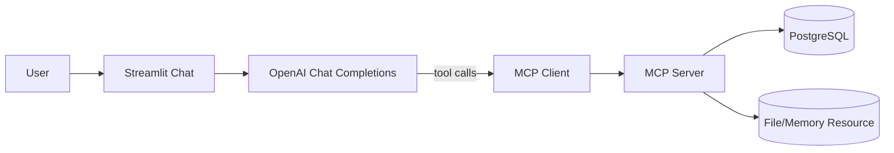

# MCP Agentic Playground

A Python portfolio project that demonstrates Agentic AI workflows using MCP (Model Context Protocol).

This repository shows how to:
- expose tools/resources/prompts through MCP servers
- consume MCP from native clients and OpenAI Agents SDK
- build a Streamlit chat UI that performs tool-calling through MCP

## Why This Matters for Agentic AI Roles

This project demonstrates practical skills expected in Agentic AI Engineer positions:
- tool orchestration with MCP
- multi-entrypoint architecture (CLI + SDK + UI)
- environment-driven configuration
- reproducible local setup for fast onboarding

## Project Structure

- `classes/`: reusable client components (`mcp_client.py`, `llm_client.py`)
- `servers/`: MCP servers (`server_test.py`, `server_sql.py`)
- `cliente_nativo/`: native MCP usage examples
- `cliente_openai/`: OpenAI Agents SDK + MCP example
- `streamlit/`: chat UI integrated with MCP tools

## Architecture



## Quickstart (Fresh Machine)

### 1. Clone and enter project

```bash
git clone <your-repo-url>
cd mcp-agentic-playground
```

### 2. Create and activate virtual environment

Windows PowerShell:

```powershell
python -m venv venv
(Set-ExecutionPolicy -Scope Process -ExecutionPolicy RemoteSigned)
.\venv\Scripts\Activate.ps1
```

macOS/Linux:

```bash
python -m venv venv
source venv/bin/activate
```

### 3. Install dependencies

```bash
pip install -r requirements.txt
```

### 4. Configure environment

```bash
copy .env.example .env
```

Then update `OPENAI_API_KEY` in `.env`.

## Run Demos

### A. Run demo MCP server

This project supports two server startup modes.

#### Option 1: SSE transport (recommended for current native client example)

Use this mode when running `cliente_nativo/client_example.py` as currently written.
It connects to `http://localhost:8000/sse` by default.

Terminal 1:

```bash
mcp run -t sse servers/server_test.py
```

Terminal 2:

```bash
python cliente_nativo/client_example.py
```

You can override the URL with an environment variable:

Windows (PowerShell):

```powershell
$env:MCP_SSE_URL = "http://localhost:8000/sse"
python cliente_nativo/client_example.py
```

macOS/Linux:

```bash
export MCP_SSE_URL="http://localhost:8000/sse"
python cliente_nativo/client_example.py
```

#### Option 2: STDIO transport (single-process flow)

Use this mode when the client starts the server process itself.

In `cliente_nativo/client_example.py`:
- enable: `await client.initialize_with_stdio("mcp", ["run", "servers/server_test.py"])`
- disable/comment: `await client.initialize_with_sse(...)`

Then run only:

```bash
python cliente_nativo/client_example.py
```

### B. Native MCP client example

```bash
python cliente_nativo/client_example.py
```

### C. OpenAI Agents + MCP example

```bash
python cliente_openai/chat_agent_example.py
```

### D. Streamlit chat app

```bash
streamlit run streamlit/chat.py
```

## Troubleshooting

### Error: `typer is required`

Install MCP CLI extras:

```bash
pip install "mcp[cli]"
```

### Error: `ModuleNotFoundError: No module named 'mcp'`

Ensure the virtual environment is active and reinstall dependencies:

```bash
python -m pip install -r requirements.txt
python -m pip install "mcp[cli]"
```

### Error: `ConnectError: All connection attempts failed`

Most common cause: the client is using SSE but the server is not running with SSE transport.

Start the server with:

```bash
mcp run -t sse servers/server_test.py
```

Keep it running in a separate terminal before starting the client.

### Error: FastMCP type mismatch (`fastmcp` vs `mcp.server.fastmcp`)

Server files must import FastMCP from MCP package:

```python
from mcp.server.fastmcp import FastMCP
```

Do not mix with standalone `fastmcp` import.

## UI Preview


## Configuration Notes

- `server_sql.py` supports environment overrides via:
  - `MCP_SQL_HOST`
  - `MCP_SQL_PORT`
  - `MCP_SQL_DATABASE`
  - `MCP_SQL_USER`
  - `MCP_SQL_PASSWORD`
- Public demo DB defaults are kept for portfolio convenience.

## Known Limitations

- No CI pipeline yet.
- No automated tests yet (only manual smoke checks).
- SQL tool currently executes raw SQL and should be constrained for production use.

## Suggested Next Steps

1. Add smoke tests for tools/resources/prompts.
2. Add CI (lint + smoke test) on pull requests.
3. Add screenshots/GIF of Streamlit flow for recruiter-first visualization.

## License

MIT. See [LICENSE](LICENSE).
